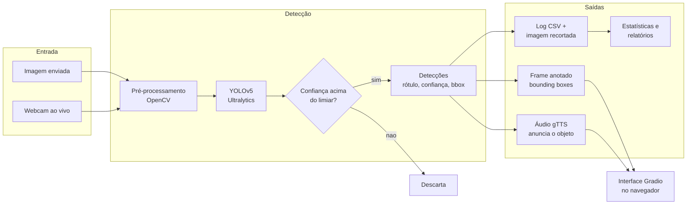

<div align="center">

# 🎯 Detecção de Objetos em Tempo Real com YOLOv5 e Áudio

**Envie uma imagem ou ligue a webcam, veja as _bounding boxes_ na hora e ouça o sistema anunciar cada objeto por voz, tudo numa interface Gradio que roda no navegador.**

[](https://www.python.org/downloads/)
[](LICENSE)
[](https://github.com/psf/black)


[](https://pytorch.org/)
[](https://github.com/ultralytics/ultralytics)
[](https://opencv.org/)
[](https://www.gradio.app/)
[](https://www.docker.com/)


</div>

Sistema completo de visão computacional que combina **YOLOv5**, **OpenCV** e **Gradio** para detectar objetos em imagens e na webcam. Cada detecção vira três coisas ao mesmo tempo: uma caixa anotada com o rótulo e a confiança, um anúncio em áudio por voz (gTTS) e um registro em CSV com a imagem recortada. O projeto vem empacotado com testes, Docker e pipeline de CI/CD, pronto para rodar e para evoluir.

## 📋 Índice

- [Características](#características)
- [Arquitetura e Pipeline](#arquitetura-e-pipeline)
- [Tecnologias](#tecnologias)
- [Instalação](#instalação)
- [Uso](#uso)
- [Configuração](#configuração)
- [Exemplos](#exemplos)
- [API](#api)
- [Desenvolvimento](#desenvolvimento)
- [Docker](#docker)
- [Estrutura do Projeto](#estrutura-do-projeto)
- [Precisão do Modelo](#precisão-do-modelo)
- [Contribuindo](#contribuindo)
- [Licença](#licença)

## ✨ Características

- 🎯 **Detecção em imagens e em tempo real**: inferência com YOLOv5 (Ultralytics) tanto em imagens enviadas quanto no fluxo ao vivo da webcam.
- 🟩 **Anotação visual**: cada objeto ganha uma _bounding box_ com rótulo e percentual de confiança desenhados via OpenCV.
- 🎤 **Narração por voz**: anúncio em áudio de cada detecção com gTTS (Google Text-to-Speech) e reprodução multiplataforma (Windows, Linux e macOS).
- 📊 **Log automático em CSV**: cada detecção é registrada com data, rótulo, confiança e coordenadas da caixa.
- 💾 **Recorte salvo em imagem**: a região detectada é recortada e salva em disco automaticamente.
- 📈 **Estatísticas e exportação**: total de detecções, objetos únicos, confiança média, objetos mais comuns e período, com exportação em CSV, JSON ou Excel.
- 🖥️ **Interface Gradio com 4 abas**: Detecção em Imagens, Detecção em Tempo Real, Configurações e Estatísticas, ajustáveis em tempo de execução.
- 🎚️ **Filtro de classes**: liste apenas as classes que quer detectar (`allowed_classes`) ou exclua algumas (`excluded_classes`).
- ⚙️ **Configuração flexível**: tudo controlado por um `.env` ou pela dataclass `Config` (`from_env`, `from_dict`, `to_dict`).
- 🐳 **Pronto para Docker**: `Dockerfile` e `docker-compose.yml`, com perfil opcional de monitoramento (Prometheus e Grafana).
- 🚦 **CI/CD**: pipeline no GitHub Actions com matriz Windows, Linux e macOS por Python 3.8 a 3.11, linting (flake8, black, mypy), testes (pytest com cobertura) e scan de segurança (bandit).
- 🌐 **Multiplataforma**: funciona em Windows, Linux e macOS.

## 🧭 Arquitetura e Pipeline

Da entrada ao navegador, o fluxo de dados é o seguinte:



O código é modular: `Config` centraliza os parâmetros, `ObjectDetector` cuida da inferência, `Speaker` do áudio, `DetectionLogger` do registro e `GradioInterface` amarra tudo na interface web.

## 🛠️ Tecnologias

| Camada | Ferramenta |
|--------|------------|
| Modelo de detecção | YOLOv5 via [Ultralytics](https://github.com/ultralytics/ultralytics) |
| Deep learning | [PyTorch](https://pytorch.org/) |
| Visão computacional | [OpenCV](https://opencv.org/) |
| Interface web | [Gradio](https://www.gradio.app/) |
| Síntese de voz | [gTTS](https://pypi.org/project/gTTS/) (Google Text-to-Speech) |
| Dados e logging | [pandas](https://pandas.pydata.org/) |
| Empacotamento | Docker e Docker Compose |
| Qualidade | pytest, black, flake8, mypy, bandit |

## 📥 Instalação

### Pré-requisitos

- Python 3.8 ou superior
- pip
- Webcam (opcional, apenas para a detecção em tempo real)

Na primeira execução, os pesos do modelo (`yolov5su.pt`) são baixados automaticamente pela Ultralytics.

### A partir do código-fonte

1. Clone o repositório:

```bash
git clone https://github.com/Ronbragaglia/DeteccaoObjetos.git
cd DeteccaoObjetos
```

2. Crie e ative um ambiente virtual (recomendado):

```bash
python -m venv venv
source venv/bin/activate   # Linux/macOS
# ou
venv\Scripts\activate      # Windows
```

3. Instale as dependências:

```bash
pip install -r requirements.txt
```

4. Configure as variáveis de ambiente:

```bash
cp .env.example .env
# Edite o .env conforme necessário
```

> Dica: instalando em modo editável com `pip install -e .`, o comando `deteccao-objetos` fica disponível como atalho para `python main.py`.

### Via Docker

```bash
docker build -t deteccao-objetos .
docker run -p 7860:7860 deteccao-objetos
```

### Via Docker Compose

```bash
docker-compose up -d
```

## 🚀 Uso

### ▶️ Rodando a demo Gradio

O jeito recomendado de rodar é pela aplicação modular completa:

```bash
python main.py
```

O que acontece:

1. As configurações são carregadas do `.env`, o modelo YOLOv5 é inicializado e a interface Gradio sobe.
2. A demo abre no navegador em `http://localhost:7860`. Com `GRADIO_SHARE=true`, um link público `*.gradio.live` também é gerado.
3. Use as abas para interagir:
   - **📷 Detecção em Imagens**: envie uma imagem e clique em **Detectar Objetos** para ver as caixas anotadas.
   - **📹 Detecção em Tempo Real**: clique em **Iniciar Detecção** para ligar a webcam. Uma janela do OpenCV abre com a detecção ao vivo. Pressione `q` nessa janela (ou o botão **Parar**) para encerrar.
   - **⚙️ Configurações**: ajuste o limiar de confiança e ligue ou desligue áudio, logging e salvamento de imagens em tempo de execução.
   - **📊 Estatísticas**: veja o resumo das detecções registradas.

> **Placeholder de demo:** um GIF curto da aba "Detecção em Tempo Real" (objetos sendo detectados ao vivo com narração em áudio) cairia muito bem aqui. Sugestão: grave a tela, salve como `docs/demo.gif` e referencie com ``.

> **Nota sobre a webcam:** a detecção em tempo real usa a câmera local e abre uma janela do OpenCV na máquina que roda o servidor. Em um container Docker sem acesso a câmera e sem display, prefira a aba de imagens; a detecção ao vivo funciona melhor rodando localmente.

### Modo script (entrada alternativa)

O repositório também mantém o script original, mais enxuto, com uma interface Gradio de imagem única e detecção via webcam por thread:

```bash
python detecao_objetos.py
```

## ⚙️ Configuração

O sistema é configurado por variáveis de ambiente. Copie `.env.example` para `.env` e ajuste:

```env
# Modelo
MODEL_NAME=yolov5su.pt
CONFIDENCE_THRESHOLD=0.3
MAX_DETECTIONS=100
DEVICE=cpu

# Áudio
AUDIO_ENABLED=true
AUDIO_LANGUAGE=pt

# Logging
LOGGING_ENABLED=true
LOG_FILE=detections_log.csv
LOG_LEVEL=INFO

# Imagens
SAVE_IMAGES=true
IMAGE_SAVE_PATH=detections_images
IMAGE_FORMAT=jpg
IMAGE_QUALITY=95

# Webcam
WEBCAM_INDEX=0
WEBCAM_WIDTH=640
WEBCAM_HEIGHT=480
WEBCAM_FPS=30

# Gradio
GRADIO_SHARE=true
GRADIO_PORT=7860
GRADIO_SERVER_NAME=0.0.0.0
```

### Filtro de classes

Detecte apenas classes específicas:

```python
from src.config.config import Config

config = Config(allowed_classes=["person", "car", "dog"])
```

Ou exclua classes específicas:

```python
config = Config(excluded_classes=["person", "cell phone"])
```

## 📚 Exemplos

Consulte a pasta [`examples/`](examples/):

- [`basic_usage.py`](examples/basic_usage.py): uso básico de ponta a ponta com a webcam.
- [`advanced_usage.py`](examples/advanced_usage.py): filtro de classes, exportação de logs, estatísticas e configurações personalizadas.

```bash
python examples/basic_usage.py
python examples/advanced_usage.py
```

Exemplo mínimo de detecção em uma imagem:

```python
from src.config.config import Config
from src.detection.detector import ObjectDetector

config = Config()
detector = ObjectDetector(config)

detections, annotated_frame = detector.detect_from_image_path("minha_imagem.jpg")

for d in detections:
    print(f"{d.label}: {d.confidence:.1%} em {d.bbox}")
```

## 📖 API

### Config

```python
from src.config.config import Config

config = Config()                                  # padrão
config = Config(confidence_threshold=0.7,          # personalizado
                audio_enabled=False)
config = Config.from_env()                         # a partir do ambiente
config = Config.from_dict({"confidence_threshold": 0.7})
```

### ObjectDetector

```python
from src.detection.detector import ObjectDetector

detector = ObjectDetector(config)

detections, annotated_frame = detector.detect(frame)          # a partir de um numpy array
detections, annotated_frame = detector.detect_from_image_path("img.jpg")
info = detector.get_model_info()
classes = detector.get_class_names()
```

Cada item de `detections` é um `Detection` com `label`, `confidence`, `bbox` e `to_dict()`.

### Speaker

```python
from src.audio.speaker import Speaker

speaker = Speaker(config)
speaker.speak("Olá, mundo!")
speaker.speak_detection("person", 0.85)
speaker.set_enabled(False)
```

### DetectionLogger

```python
from src.logging.logger import DetectionLogger

logger = DetectionLogger(config)
logger.log_detections(detections, frame)
stats = logger.get_statistics()
logger.export_log("saida.csv", format="csv")
logger.export_log("saida.json", format="json")
```

## 🧪 Desenvolvimento

### Testes

```bash
pytest                          # todos os testes
pytest --cov=src                # com cobertura
pytest tests/test_config.py     # arquivo específico
pytest -m unit                  # apenas testes unitários
```

### Qualidade de código

```bash
black src/ tests/               # formatação
flake8 src/ tests/              # lint
mypy src/                       # checagem de tipos
```

O pipeline em [`.github/workflows/ci.yml`](.github/workflows/ci.yml) roda esses mesmos passos em uma matriz de Windows, Linux e macOS por Python 3.8 a 3.11, mais o scan de segurança com bandit.

## 🐳 Docker

### Construir e executar

```bash
docker build -t deteccao-objetos .

docker run -p 7860:7860 \
  -v $(pwd)/models:/app/models \
  -v $(pwd)/logs:/app/logs \
  deteccao-objetos
```

### Docker Compose

```bash
docker-compose up -d       # sobe o serviço de detecção
docker-compose logs -f     # acompanha os logs
docker-compose down        # encerra
```

O `docker-compose.yml` traz um perfil opcional `monitoring` com Prometheus e Grafana. O Grafana lê a senha de administrador da variável `GF_SECURITY_ADMIN_PASSWORD` definida no `.env`, e o Prometheus espera um `prometheus.yml` na raiz do projeto.

## 📁 Estrutura do Projeto

```
DeteccaoObjetos/
├── src/                      # Código-fonte modular
│   ├── config/               # Config (dataclass, .env, filtros de classe)
│   ├── detection/            # ObjectDetector + dataclass Detection (YOLOv5)
│   ├── audio/                # Speaker (gTTS, playback multiplataforma)
│   ├── logging/              # DetectionLogger (CSV, imagens, estatísticas)
│   └── interface/            # GradioInterface (4 abas)
├── tests/                    # Testes pytest (conftest, test_config, test_detector)
├── examples/                 # basic_usage.py e advanced_usage.py
├── docs/                     # Documentação
├── data/                     # Dados
├── models/                   # Pesos YOLO (baixados em tempo de execução)
├── .github/workflows/ci.yml  # Pipeline de CI/CD
├── main.py                   # Ponto de entrada modular (app completo)
├── detecao_objetos.py        # Script original enxuto (entrada alternativa)
├── requirements.txt          # Dependências
├── pyproject.toml            # Build, lint, testes e cobertura
├── Dockerfile                # Imagem Docker
├── docker-compose.yml        # Orquestração (+ perfil monitoring opcional)
├── .env.example              # Modelo de variáveis de ambiente
├── CONTRIBUTING.md           # Guia de contribuição
├── CHANGELOG.md              # Histórico de versões
├── LICENSE                   # Licença MIT
└── README.md                 # Este arquivo
```

Ao rodar, o sistema cria `detections_log.csv`, a pasta `detections_images/` e o arquivo `app.log`.

## 📊 Precisão do Modelo

O YOLOv5s tem boa precisão para objetos comuns. Durante os testes, foram observados os seguintes valores médios de confiança:

| Objeto | Precisão Média |
|--------|----------------|
| 🧑‍🤝‍🧑 Pessoa | 85 a 90% |
| 📱 Celular | 70 a 80% |
| 📺 TV | 65 a 80% |
| 💻 Laptop | 50 a 80% |
| 🌱 Planta | 30 a 40% |

A precisão varia conforme a iluminação, a distância e a qualidade da câmera.

## 🤝 Contribuindo

Contribuições são bem-vindas. Leia o [`CONTRIBUTING.md`](CONTRIBUTING.md) para os detalhes.

1. Faça um fork do repositório.
2. Crie uma branch para sua feature: `git checkout -b feature/MinhaFeature`.
3. Commite suas mudanças: `git commit -m "Add: minha feature"`.
4. Faça push para a branch: `git push origin feature/MinhaFeature`.
5. Abra um Pull Request.

## 📄 Licença

Este projeto está licenciado sob a Licença MIT. Veja o arquivo [`LICENSE`](LICENSE) para detalhes.

## 👤 Autor

**Rone Bragaglia**

- GitHub: [@Ronbragaglia](https://github.com/Ronbragaglia)

## 🙏 Agradecimentos

- [Ultralytics](https://github.com/ultralytics/ultralytics) pelo YOLOv5
- [Gradio](https://www.gradio.app/) pela interface
- [OpenCV](https://opencv.org/) pelo processamento de imagens
- [gTTS](https://pypi.org/project/gTTS/) pela síntese de voz

## 📞 Suporte

Encontrou um problema ou tem uma ideia? Abra uma [issue](https://github.com/Ronbragaglia/DeteccaoObjetos/issues).

## 📝 Changelog

Veja o [`CHANGELOG.md`](CHANGELOG.md) para o histórico de mudanças.

---

<div align="center">

**⭐ Se este projeto foi útil para você, deixe uma estrela! ⭐**

</div>
